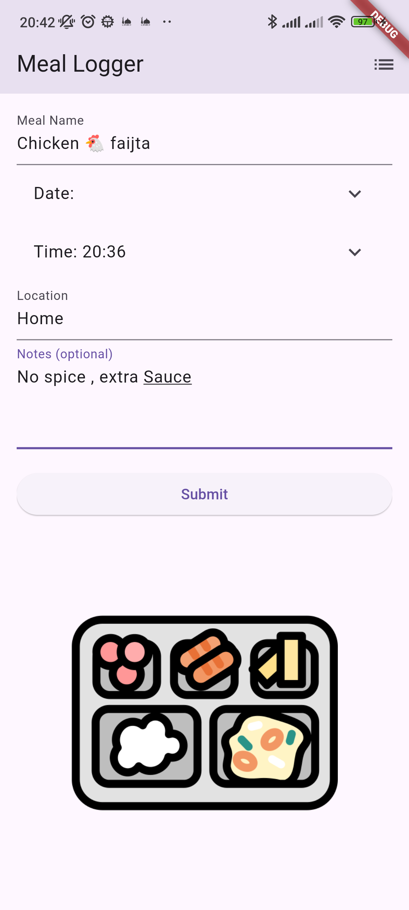

# Meal Logger


A Flutter application for logging meals with information such as meal name, date, time, location, and notes. Data is stored in a Google Sheets backend.

## Screenshots


## Features

- Log meal information with a user-friendly form
- View logged meals in a convenient table format
- Pull-to-refresh functionality to reload meal data
- Submit data to Google Sheets for easy tracking
- Fetch data from Google Sheets for seamless synchronization

## Getting Started

### Prerequisites

- [Flutter SDK](https://flutter.dev/docs/get-started/install)
- [Dart SDK](https://dart.dev/get-dart)
- [Google Sheets API setup](https://developers.google.com/sheets/api/quickstart/js)
- IDE: [VS Code](https://code.visualstudio.com/) or [Android Studio](https://developer.android.com/studio)

### Installation

1. Clone the repository:
   ```bash
   git clone https://github.com/yourusername/meal_logger.git
   cd meal_logger
   ```

2. Install dependencies:
   ```bash
   flutter pub get
   ```

3. Create a `.env` file in the root directory with your Google Sheets API URL:
   ```env
   GOOGLE_APP_SCRIPT_URL=https://script.google.com/macros/s/your_script_id/exec
   ```

4. Run the application:
   ```bash
   flutter run
   ```

## Project Structure

```plaintext
lib
├── features
│   ├── meals
│   │   ├── models
│   │   │   └── meal.dart
│   │   ├── services
│   │   │   └── meal_service.dart
│   │   └── views
│   │       ├── meal_logger.dart
│   │       └── meals_table_view.dart
├── main.dart
```

## Usage

### Log a Meal

1. Open the app and fill out the form with meal details.
2. Tap the submit button to save the meal information.

### View Meals

1. Tap the list icon in the app bar to view all logged meals.
2. Pull down to refresh the meal list.

## License

This project is licensed under the MIT License. See the [LICENSE](LICENSE) file for details.

## Contributors

- [Waleed Alrashed](https://github.com/WaleedAlrashed)

## Additional Information

For prompts, I've used this custom Flutter GPT: [Flutter GPT](https://chatgpt.com/g/g-cZPwvslfA-flutter) from [Widenex GPTs](https://gpts.widenex.com). They have awesome modified ChatGPTs to handle most of the programming languages for your needs.

Using the correct prompts and understanding prompt engineering has been invaluable in building this product efficiently and effectively. It demonstrates the power of AI in accelerating development and enhancing productivity. By tailoring the prompts to my specific needs, I was able to streamline the process and achieve quick results.

Enjoy using Meal Logger!
